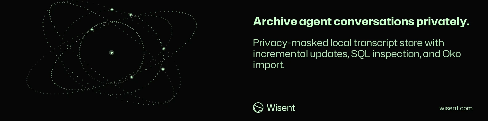
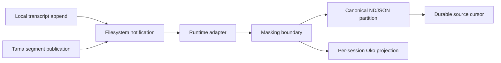

<!-- wisent-banner:start -->
<p align="center">
  
</p>
<!-- wisent-banner:end -->

<!-- wisent-readme-signals:start -->
[](https://github.com/wisent-ai/transcript-lake) [](https://github.com/wisent-ai/transcript-lake/issues) [](https://wisent.com) [](https://discord.gg/qRjpkthq54) [](https://www.linkedin.com/company/wisent-ai/) [](https://x.com/wisentai) [](https://calendly.com/lbartoszcze)
<!-- wisent-readme-signals:end -->

# Transcript Lake: All the Knowledge from Your AI Agent Conversations, Organized

Nothing You Ever Told an AI Is Lost Again.

Every hour your team spends with an agent produces the most valuable transcript
in your company, and then it dies in a terminal nobody reopens. Transcript Lake
catches all of it as it happens — every client, every machine, every session —
and writes it into one archive you can query with plain SQL. Names, keys and
paths are masked on the way in, so the archive is safe to keep and safe to share.
Ask it who solved this before, what a project actually cost in tokens, or how
long a contractor really worked, and the answer is a query away. Nothing has to
be exported, remembered or reconstructed after the fact.

Your Company’s Memory, Written as It Happens.

## Problem and intended users

Coding agents persist conversations in incompatible local formats. Comparing activity across Claude Code, Codex, OMP, Droid, Kimi, and adaptive hooks otherwise requires provider-specific parsers, repeated full scans, and unsafe handling of raw transcripts.

Transcript Lake is for:

- **individual developers** who need one local history without copying raw credentials into an analytics store;
- **engineering and product operators** who need cross-runtime session, tool, token, and hook-decision evidence;
- **Oko operators** who need a stable provider-neutral transcript feed rather than another set of vendor parsers;
- **adapter maintainers** who add support for a verified local transcript format behind one canonical event contract.

Its value is one live parsing and masking boundary: every downstream consumer reads the same normalized evidence instead of independently handling raw vendor files.

## Product boundaries

### Included

- Real-time, newline-aligned streaming from local Claude Code, Codex, OMP, Droid, and Kimi session stores.
- Real-time adaptive-hook decisions from Tama telemetry segments or its legacy local log.
- Provider-neutral NDJSON events for user, assistant, thinking, tool, usage, metadata, and hook-decision records.
- Deterministic masking before any event reaches durable Lake storage.
- Cursor-based restart, append-only daily partitions, live status, DuckDB views, and Parquet compaction.
- A per-session Oko projection updated in the same stream commit as Lake partitions.

### Explicit non-goals

- Transcript Lake is not a chat UI, agent runtime, cloud service, or team synchronization system.
- It does not modify vendor transcript stores.
- It does not provide semantic or vector search.
- It does not currently ship Gemini or Qwen adapters.
- It does not fully anonymize conversations. Hostname, runtime, timestamps, session identifiers, project paths, model names, and bounded structural metadata remain available for correlation.
- It does not run periodic scans or require an external scheduler; one supervised `stream` process follows source writes continuously.

### Environment and constraints

- Current source formats and paths are supported on macOS. Other operating systems are not qualified.
- The CLI is a single self-contained binary built from Rust. Running it requires no language runtime; building it requires a Rust toolchain.
- DuckDB CLI `1.5.x` is required only for SQL queries and Parquet compaction.
- Oko and Tama are optional integrations. Core streaming remains usable without them.
- Data remains local under `LAKE_DATA`, defaulting to `~/.transcript-lake`.
- Historical reconstruction is explicit through `rebuild` into a separate empty Lake.

## Core use cases

| Actor | Initial situation | Desired result | Product action | Safety and cost boundary |
|---|---|---|---|---|
| Developer | Several supported agents append local session files | One masked, continuously current archive | Run `transcript-lake stream` under a supervisor | Reads only changed source files; writes only beneath `LAKE_DATA` |
| Analyst | Lake partitions exist | Cross-runtime session, tool, token, or hook evidence | Run `transcript-lake query "<sql>"` | Read-only over Lake data; requires local DuckDB |
| Operator | NDJSON partitions consume too much scan time | Immutable additive Parquet mirrors | Run `transcript-lake compact` | Adds files; never deletes NDJSON partitions |
| Oko operator | Oko must index multiple runtimes consistently | Stable per-session canonical JSONL | Keep the stream running | The projection changes in the same commit as canonical Lake events |
| Maintainer | A projection must be reconstructed | Rebuildable per-session JSONL | Run `transcript-lake rebuild-oko` | Reads authoritative masked partitions; never touches vendor stores |

## How the product works



Raw vendor text exists only on the source side of the masking boundary. A filesystem notification carries the changed path directly to its adapter; the stream resumes at that file's newline-aligned cursor, masks `text` and every string in `extra`, appends canonical events, updates affected Oko session files, and only then advances the cursor.

`LAKE_DATA/cursors.json` is the durable resume state. Daily NDJSON partitions are authoritative Lake evidence; Parquet and Oko files are rebuildable projections. Cursor and projection metadata use atomic replacement, and transcript partitions are append-only.

Start with [what Transcript Lake is](docs/what-is-transcript-lake.md) and the [executed synthetic quick start](docs/quick-start.md). The [core workflow contract](docs/CORE.md), [data contract](docs/LAKE.md), [architecture guide](docs/architecture.md), and [ingestion reference](docs/ingestion-reference.md) define state transitions, schemas, masking, paths, and recovery.

## Quick start

There is not yet a supported immutable release. The current **development channel** is installed from a source checkout and carries no stability guarantee.

### Prerequisites

- macOS with at least one supported coding-agent transcript store;
- a Rust toolchain (`cargo`) at version `1.85` or newer, to build the binary;
- DuckDB `1.5.x` on `PATH` only if you will query or compact data;
- enough local storage for the masked copy of the selected history.

```sh
git clone https://github.com/wisent-ai/transcript-lake.git
cd transcript-lake
cargo install --path .
transcript-lake
```

With no command, the CLI prints its purpose and safe starting commands without creating Lake state. Inspect the environment before mutation:

```sh
transcript-lake paths
transcript-lake sources
transcript-lake doctor
transcript-lake --data-dir "$HOME/.transcript-lake" status
```

Start the foreground stream:

```sh
transcript-lake --data-dir "$HOME/.transcript-lake" stream
```

The process reacts to source writes immediately; it has no polling interval, quiet-period timer, full-root refresh, or child command. Each successful source delta writes its canonical partition and affected Oko sessions before committing the byte cursor.

For an always-on local installation, `scripts/install-stream-service.sh` installs the release binary and a KeepAlive LaunchAgent. Vendor transcripts remain read-only, and `clean` still previews removal of rebuildable artifacts only.

Continue with the [complete CLI reference](docs/cli-reference.md), [masking guarantees](docs/masking-guarantees.md), [operator runbook](docs/runbook.md), [full onboarding guide](docs/ONBOARDING.md), and [canonical examples catalog](examples/README.md).

## Primary interfaces

The CLI is the canonical human and automation interface.

| Operation | Interface | Observable result |
|---|---|---|
| Guidance and identity | `transcript-lake help [command]`, `--version` | Exact syntax, safety guidance, or canonical version |
| Paths and discovery | `paths`, `sources` | Resolved state/integration paths and available runtime stores |
| Health | `doctor [--json]` | Cursor, source, DuckDB, and Oko checks with meaningful exit status |
| Real-time stream | `stream [--json]` | Long-running event-driven source tail with direct Lake and Oko commits |
| Safe recovery | `rebuild --to <empty-path> [--source <runtime>]` | Historical replay into a separate empty Lake |
| Inspect | `status [--json]` | Partition, cursor, stream-state, and Oko freshness inventory |
| Sessions and events | `sessions [--interrupted]`, `events` | Filtered recent normalized records; `--interrupted` keeps only conversations left without an answer |
| Text search | `search <text> [--runtime <r>] [--session <id>] [--type <t>] [--limit <n>] [--json]` | Newest-first literal substring matches over masked event text |
| Conversation restore | `show <session-id> [--include <types>] [--limit <n>] [--json]` | One conversation reconstructed oldest turn first, full masked text, with a rendered/matched footer |
| Session labels | `label add`, `label list`, `label aspects` | Operator-owned aspect/value annotations over sessions |
| Statistics and signals | `stats`, `hooks`, `signals` | Usage aggregates, adaptive-hook decisions, and Oko/Lake correlations |
| Advanced SQL | `query [--json] \"<sql>\"` | DuckDB result or actionable dependency error |
| Compact | `compact [--source <runtime>] [--json]` | Per-runtime NDJSON-to-Parquet report |
| Projection recovery | `rebuild-oko [--reindex]`, `oko-refresh` | Reconstruct the Oko projection or explicitly reindex it |
| Derived cleanup | `clean [--target <parquet|oko|all>] [--apply]` | Dry-run by default; removes rebuildable data only with `--apply` |

Canonical event and adapter interfaces are machine contracts documented in [the architecture contract](docs/LAKE.md). Every supported operation maps to [one canonical example](examples/README.md).

## Operational model

- **Configuration:** global `--data-dir <path>` selects the state root for one invocation; `LAKE_DATA` remains the automation default. `OKO_CLI` optionally selects the Oko executable. Unset values use documented local defaults; there are no credential fallbacks.
- **State ownership:** vendor runtimes own source transcripts; Transcript Lake alone owns `LAKE_DATA`; Oko owns its SQLite index and imports a derived Lake export read-only.
- **Credentials:** core streaming needs none. Transcript contents may contain credentials, so masking occurs before durable Lake writes. Do not share a Lake directory as though it were anonymized data.
- **Upgrades:** use an immutable release once available. State layout compatibility, rollback, and release channels are defined in [release policy](docs/RELEASES.md).
- **Observability:** `paths`, `sources`, `doctor`, `status --json`, and stream logs expose configuration, availability, freshness, counts, and failures.
- **Recovery:** the supervised stream resumes from durable byte cursors; a truncation, same-size rewrite, or damaged cursor is rejected, and `rebuild --to <empty-path>` reconstructs a separate Lake without mutating the current one.
- **Retention:** no automatic authoritative deletion is performed. `clean` handles only rebuildable Parquet and Oko artifacts, previews by default, and requires `--apply`.
- **Integrations:** capability, dependency, failure, and removal contracts are in [integration contracts](docs/INTEGRATIONS.md).

## Project status and support

- **Maturity:** development (`0.x` contract; no supported immutable release yet).
- **Current compatibility:** macOS; a self-contained binary built with Rust `1.85` or newer; DuckDB `1.5.x` for SQL/compaction; locally observed formats for Claude Code, Codex, OMP, Droid, Kimi, and Tama hook telemetry.
- **Support and defects:** [GitHub Issues](https://github.com/wisent-ai/transcript-lake/issues).
- **Security reports:** use a private [GitHub security advisory](https://github.com/wisent-ai/transcript-lake/security/advisories/new); do not disclose transcript data or credentials in a public issue.
- **License:** MIT; see [LICENSE](LICENSE).

Current behavior is described in this README. Planned capabilities must be labeled as planned and are not supported until released with matching examples and evidence.