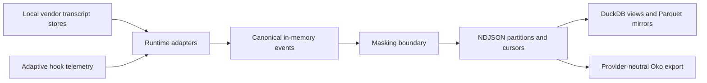

# Transcript Lake

Transcript Lake turns local coding-agent conversations into one privacy-masked, incrementally updated event archive that operators can inspect with SQL and import into Oko.

## Problem and intended users

Coding agents persist conversations in incompatible local formats. Comparing activity across Claude Code, Codex, OMP, Droid, Kimi, and adaptive hooks otherwise requires provider-specific parsers, repeated full scans, and unsafe handling of raw transcripts.

Transcript Lake is for:

- **individual developers** who need one local history without copying raw credentials into an analytics store;
- **engineering and product operators** who need cross-runtime session, tool, token, and hook-decision evidence;
- **Oko operators** who need a stable provider-neutral transcript feed rather than another set of vendor parsers;
- **adapter maintainers** who add support for a verified local transcript format behind one canonical event contract.

Its value is a single ingestion and masking boundary: every downstream consumer reads the same normalized evidence instead of independently handling raw vendor files.

## Product boundaries

### Included

- Incremental, newline-aligned ingestion from local Claude Code, Codex, OMP, Droid, and Kimi session stores.
- Import of adaptive-hook decisions from the local Tama telemetry log when present.
- Provider-neutral NDJSON events for user, assistant, thinking, tool, usage, metadata, and hook-decision records.
- Deterministic masking before any event reaches durable Lake storage.
- Cursor-based restart, append-only daily partitions, status reporting, DuckDB views, and Parquet compaction.
- A canonical, per-session export consumed by Oko.

### Explicit non-goals

- Transcript Lake is not a chat UI, agent runtime, cloud service, or team synchronization system.
- It does not modify vendor transcript stores.
- It does not provide semantic or vector search.
- It does not currently ship Gemini or Qwen adapters.
- It does not fully anonymize conversations. Hostname, runtime, timestamps, session identifiers, project paths, model names, and bounded structural metadata remain available for correlation.
- It does not schedule ingestion. An operator or external scheduler invokes the CLI.

### Environment and constraints

- Current source formats and paths are supported on macOS. Other operating systems are not qualified.
- Node.js is required for every workflow. The implementation uses only Node built-ins.
- DuckDB CLI `1.5.x` is required only for SQL queries and Parquet compaction.
- Oko and Tama are optional integrations. Core ingestion remains usable without them.
- Data remains local under `LAKE_DATA`, defaulting to `~/.transcript-lake`.
- A full ingest can read the entire available local transcript history and consume proportional disk space. It is never automatic.

## Core use cases

| Actor | Initial situation | Desired result | Product action | Safety and cost boundary |
|---|---|---|---|---|
| Developer | Several supported agents have local session files | One masked, resumable local archive | Run `transcript-lake ingest` | Reads local transcripts; writes only beneath `LAKE_DATA` |
| Analyst | Lake partitions exist | Cross-runtime session, tool, token, or hook evidence | Run `transcript-lake query "<sql>"` | Read-only over Lake data; requires local DuckDB |
| Operator | NDJSON partitions consume too much scan time | Immutable additive Parquet mirrors | Run `transcript-lake compact` | Adds files; never deletes NDJSON partitions |
| Oko operator | Oko must index multiple runtimes consistently | Stable per-session canonical JSONL | Run ingest or `transcript-lake export-oko` | Export contains masked Lake events and local metadata |
| Maintainer | Oko index may be stale | Refresh Oko after export | Run `transcript-lake export-oko --reindex` | Optional child process; failure does not mutate Lake partitions |

## How the product works



Raw vendor text exists only on the source side of the masking boundary. Adapters translate source records but do not write them. The ingest driver masks `text` and every string in `extra` before appending canonical events to `LAKE_DATA/events`.

`LAKE_DATA/cursors.json` is the ingestion checkpoint and the source of incremental progress. Daily NDJSON partitions are authoritative Lake evidence. Parquet files and the Oko export are rebuildable derived views. Cursor and export metadata use atomic replacement; transcript partitions are append-only.

See [the data and architecture contract](docs/LAKE.md) for schemas, masking behavior, paths, and recovery semantics.

## Quick start

There is not yet a supported immutable release. The current **development channel** is installed from a source checkout and carries no stability guarantee.

### Prerequisites

- macOS with at least one supported coding-agent transcript store;
- Node.js available as `node`;
- DuckDB `1.5.x` on `PATH` only if you will query or compact data;
- enough local storage for the masked copy of the selected history.

```sh
git clone https://github.com/wisent-ai/transcript-lake.git
cd transcript-lake
node src/cli.mjs
```

With no command, the CLI prints its purpose, supported starting command, and help. It must not create Lake state.

To produce the first local result:

```sh
export LAKE_DATA="$HOME/.transcript-lake"
node src/cli.mjs ingest
node src/cli.mjs status
```

Expected result: `ingest` prints a JSON summary containing per-runtime counts, masking counts, duration, and Oko-export status. `status` prints the data directory, partition inventory, cursor freshness, last-ingest summary, and Oko freshness. If no supported source store exists, the result is an empty but valid Lake rather than fabricated data.

This workflow reads local transcripts and creates or updates `LAKE_DATA`. Remove only that operator-selected directory to reset the local Lake; vendor transcripts are never changed.

Continue with the [full onboarding guide](docs/ONBOARDING.md) and the [canonical examples catalog](examples/README.md).

## Primary interfaces

The CLI is the canonical human and automation interface.

| Operation | Interface | Observable result |
|---|---|---|
| Guidance | `transcript-lake`, `transcript-lake help`, `transcript-lake --help` | Human-readable safe starting instructions |
| Identity | `transcript-lake --version` | Canonical product version |
| Ingest | `transcript-lake ingest [--source <runtime>] [--full]` | Structured run summary and durable cursors/partitions |
| Inspect | `transcript-lake status` | Human-readable inventory and freshness |
| Query | `transcript-lake query "<sql>"` | DuckDB result or actionable dependency error |
| Compact | `transcript-lake compact` | Per-runtime NDJSON-to-Parquet report |
| Export | `transcript-lake export-oko [--full] [--reindex]` | Structured export summary; optional Oko reindex result |
| Refresh Oko | `transcript-lake oko-refresh` | Oko reindex status or corrective installation guidance |

Canonical event and adapter interfaces are machine contracts documented in [the architecture contract](docs/LAKE.md). Every supported operation maps to [one canonical example](examples/README.md).

## Operational model

- **Configuration:** `LAKE_DATA` selects the only mutable state root. `OKO_CLI` optionally selects the Oko executable. Unset values use documented local defaults; there are no credential fallbacks.
- **State ownership:** vendor runtimes own source transcripts; Transcript Lake alone owns `LAKE_DATA`; Oko owns its SQLite index and imports a derived Lake export read-only.
- **Credentials:** core ingestion needs none. Transcript contents may contain credentials, so masking occurs before durable Lake writes. Do not share a Lake directory as though it were anonymized data.
- **Upgrades:** use an immutable release once available. State layout compatibility, rollback, and release channels are defined in [release policy](docs/RELEASES.md).
- **Observability:** `ingest` emits structured counts; `status` reports partitions, cursor freshness, masking totals, and Oko freshness.
- **Recovery:** rerun incremental ingest after interruption. Use `--full` after deliberate source replacement or when rebuilding derived state. Back up `LAKE_DATA` before destructive operator cleanup.
- **Retention:** no automatic deletion is performed. The operator owns retention and deletion of Lake data.
- **Integrations:** capability, dependency, failure, and removal contracts are in [integration contracts](docs/INTEGRATIONS.md).

## Project status and support

- **Maturity:** development (`0.x` contract; no supported immutable release yet).
- **Current compatibility:** macOS; Node.js; DuckDB `1.5.x` for SQL/compaction; locally observed formats for Claude Code, Codex, OMP, Droid, Kimi, and Tama hook telemetry.
- **Support and defects:** [GitHub Issues](https://github.com/wisent-ai/transcript-lake/issues).
- **Security reports:** use a private [GitHub security advisory](https://github.com/wisent-ai/transcript-lake/security/advisories/new); do not disclose transcript data or credentials in a public issue.
- **License:** MIT; see [LICENSE](LICENSE).

Current behavior is described in this README. Planned capabilities must be labeled as planned and are not supported until released with matching examples and evidence.
